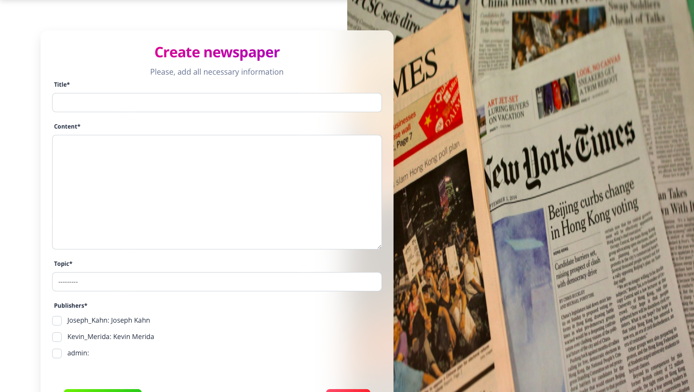
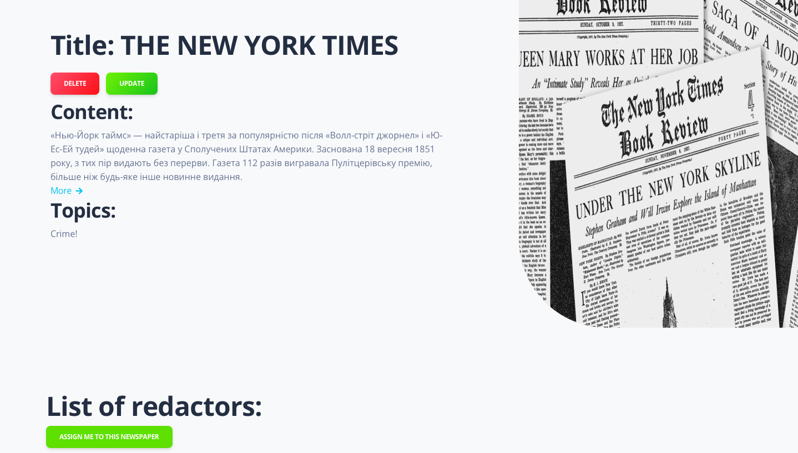
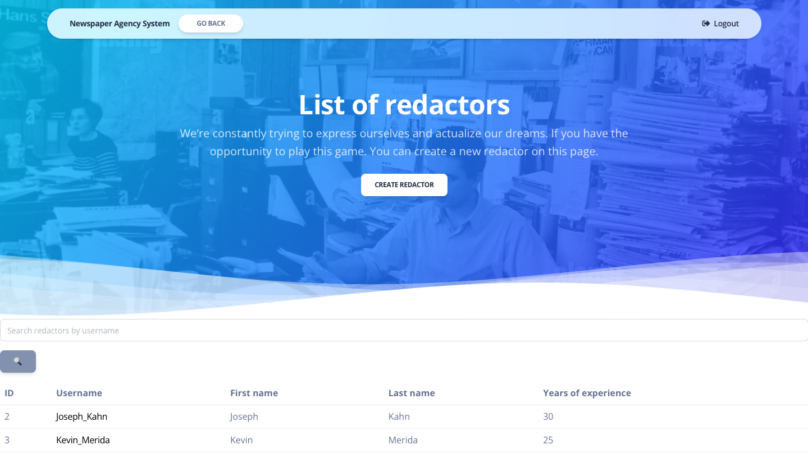

# Newspaper Agency System (NAS) - Overview

## Introduction

Welcome to the Newspaper Agency System (NAS)! 
We understand the importance of keeping track of the talented individuals who contribute 
to the creation of each newspaper. 
This README file provides essential information on NAS, a system designed to streamline 
the tracking of redactors assigned to newspapers, ensuring accurate attribution and accountability.

## Getting started

Follow these steps to set up and run the NAS project on your local machine:


1. **Clone the Repository:**
   ```bash
   git clone [repository_link]
2. **Navigate to Project Directory:**
    ```bash
   cd path/to/your/directory
3. Open Project in IDE:
Open the project in your preferred Integrated Development Environment (IDE).
4. **Create and Activate Virtual Environment:**
    ```bash
   python -m venv venv
   source venv/bin/activate
5. **Install Dependencies:**
   ```bash
    pip install -r requirements.txt
6. **Create Superuser:**
    ```bash
    python manage.py createsuperuser
7.  **Run Development Server:**
    ```bash
    python manage.py runserver
8. Access the Server:
Open your web browser and go to http://127.0.0.1:8000/ to check and use the server.

### Features

Redactor Assignment Tracking: NAS allows you to efficiently assign redactors to specific newspapers. 
This feature ensures that every newspaper publication is associated with the responsible team members. 
Search and Reporting: The system includes search and reporting functionalities, making it easy for you to 
retrieve information about specific newspapers, redactors, or publication periods. 
User-friendly Interface: NAS boasts an intuitive and user-friendly interface, designed for ease 
of use by both experienced and new users. 
The system promotes efficiency and reduces the likelihood of errors in tracking assignments.

#### Screenshots





